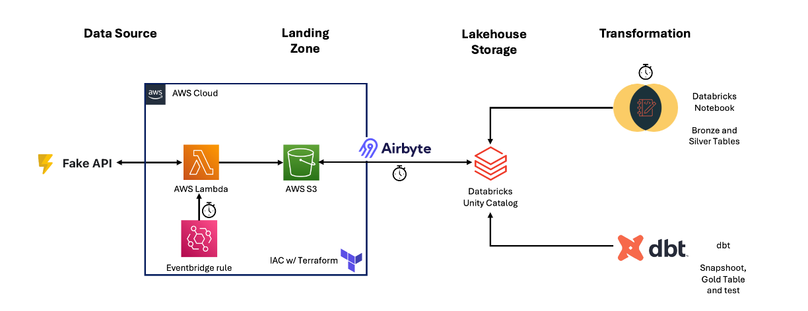

# dbt on Databricks – End-to-End Data Pipeline

This project demonstrates a simple end-to-end data pipeline using **AWS**, **Databricks**, **Airbyte**, **Terraform**, and **dbt-databricks**.



## Prerequisites

- Install dependencies:

`pip install -r requirements.txt`

- Create free accounts on:

  - [AWS](https://aws.amazon.com/free/)
  - [Databricks Community Edition](https://community.cloud.databricks.com/)
  - [Airbyte](https://airbyte.com/)

## Flow

1. **Deploy Infrastructure**

   Create a `terraform.tfvars` inside `infrastructure/` with your AWS credentials. It should be formatted like:

   ```bash
   access_key = "access-key"
   secret_key = "secret-key"
   ```

   Change the **AWS region** if desired in `infrastructure/variables.tf`

   Initialise Terraform with `cd infrastructure/` and `terraform init`

   Use Terraform to provision AWS resources:

    `terraform plan` and if all goes well with the planning: `terraform apply --auto-approve`

   Trigger the provided Lambda on the UI (only the first time as an Eventbridge rule is provided).

2. **Setup Airbyte**

   Configure a connector **from AWS S3 to Databricks Unity Catalog**.

   Follow Airbyte’s documentation for authentication and setup.

3. **Databricks Notebook Transformation - Bronze and Silver**

   Open Databricks and create a new Python notebook with **SQL language**.

   Copy the contents of:
     `databricks_notebooks/data_processing_bronze_extraction-silver_flattened.ipynb`

   Start the free computing provided in `SQL Warehouses` in the Databricks UI.

4. **Schedule Job**

   Create a Databricks Job for your notebook with **daily schedule**.

   Run it once Airbyte has finished copying the data to the Unity Catalog.

5. **Run dbt transformation - Gold, Snapshot and Generic Test**

   Initialize the dbt project (first time only): `cd dbt_db_project/` and then `dbt init` - follow the instructions to configure the connection with your `SQL Warehouse` and allow the `unit_catalog` option

   Run snapshots: `dbt snapshot --select users_scd2`

   Run models: `dbt run --select fct_daily_revenue`

   Run tests: `dbt test --select fct_daily_revenue`

---

## Notes

- Infrastructure as Code handled via Terraform.
- Data souce: AWS Lambda gets records from the Fake E-commerce API and dumps the data in CSV format inside a S3 bucket.
- Data movement: AWS S3 → Airbyte → Databricks Unity Catalog.
- Transformation: Databricks notebook and dbt model with Databricks connector.
